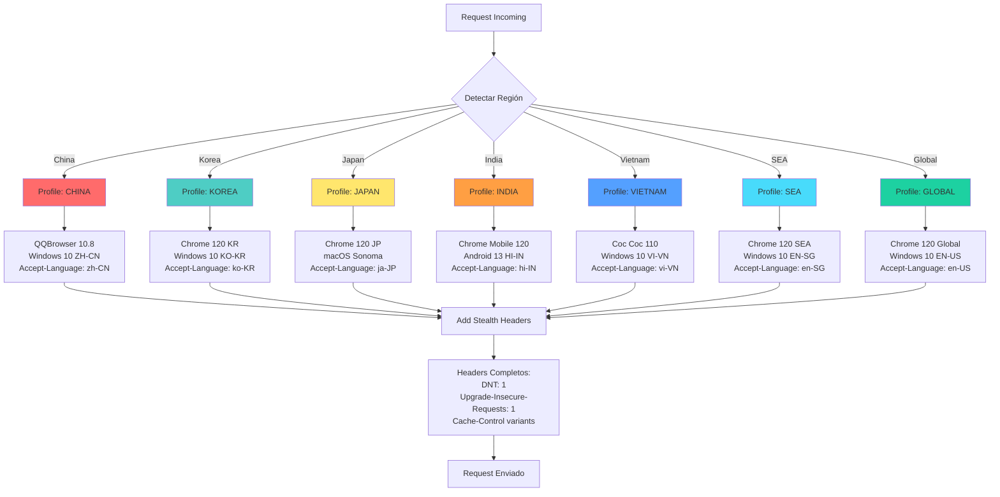
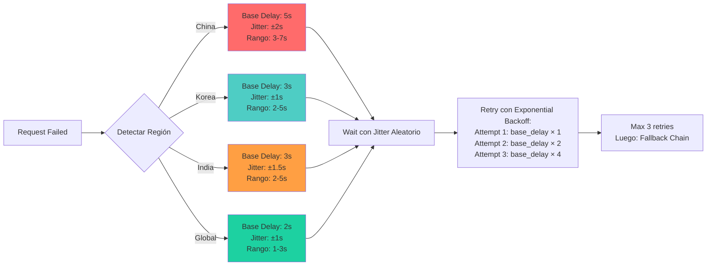
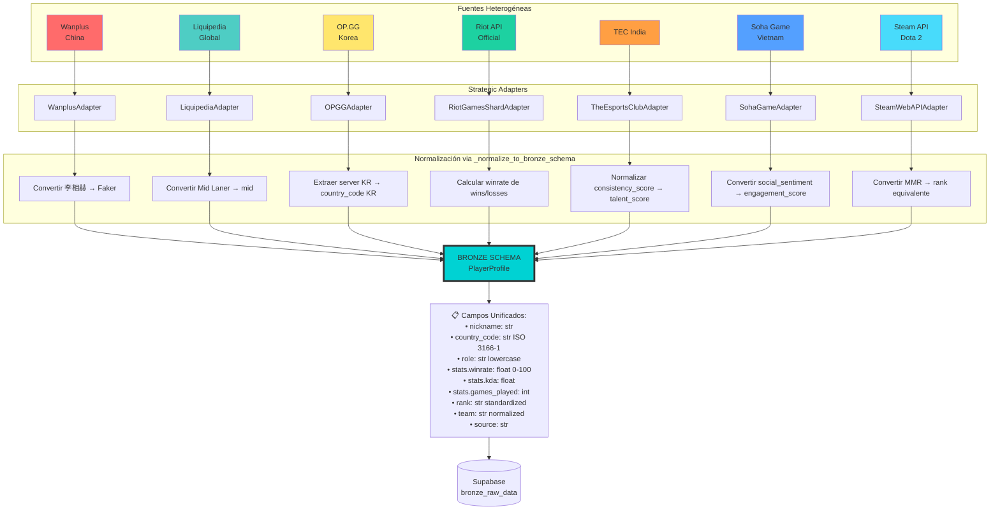
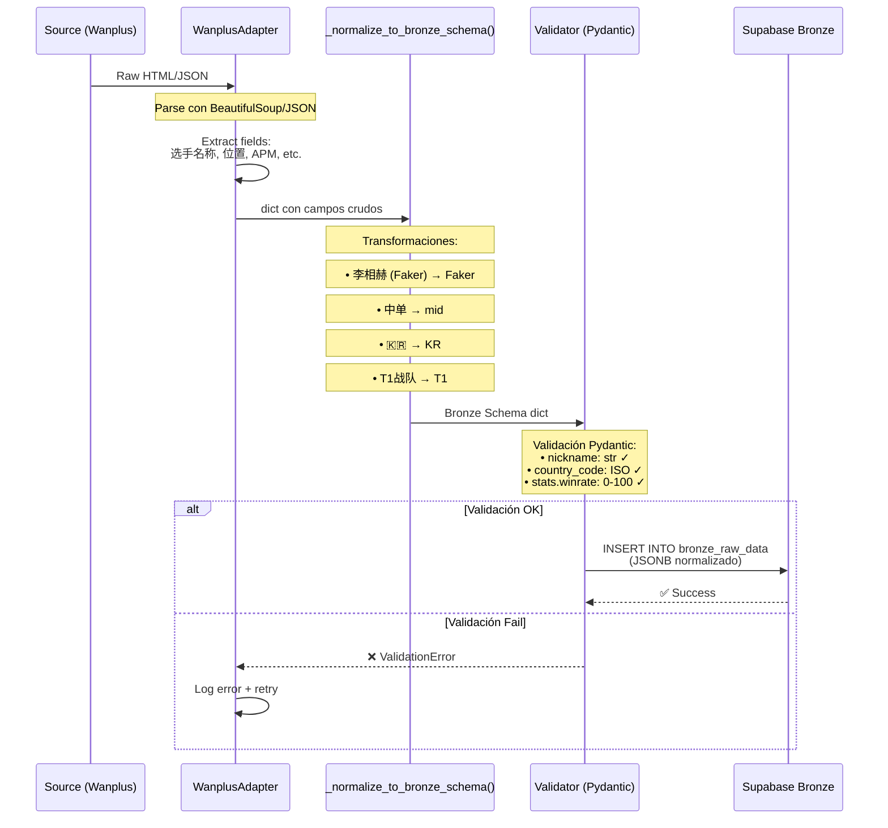

# GameRadar AI - Technical Review: Anti-Detection & Data Unification

**Fecha**: 16 de Abril, 2026  
**Revisión**: Primera Iteración Técnica  
**Enfoque**: Estrategia de Evasión y Normalización de Datos

---

## 📡 I. Estrategia de Rotación de Headers Anti-Detección

### 1.1 Problema Identificado

Cada región tiene **fingerprints únicos** de navegadores y comportamientos de usuario. Un User-Agent genérico (Chrome/Windows) es detectado inmediatamente como bot en:
- **China**: GFW (Great Firewall) bloquea User-Agents no-chinos
- **Vietnam**: Sitios locales esperan navegador Coc Coc (navegador nacional)
- **India**: Tráfico móvil domina (80%+ usuarios)
- **Korea/Japan**: Alta sofisticación técnica, detectan headers inconsistentes

### 1.2 Solución: AdvancedHeaderRotator con 7 Perfiles Regionales



### 1.3 Tabla de Fingerprints por Región

| Región | User-Agent Primario | Accept-Language | Navegador Dominante | Mobile % | Stealth Score |
|--------|---------------------|-----------------|---------------------|----------|---------------|
| **🇨🇳 China** | `Mozilla/5.0 (Windows NT 10.0; Win64; x64) AppleWebKit/537.36 (KHTML, like Gecko) Chrome/91.0.4472.124 Safari/537.36 QBCore/4.0.1316.400 QQBrowser/10.8.4559.400` | `zh-CN,zh;q=0.9` | QQBrowser (45%) | 35% | ⭐⭐⭐⭐⭐ |
| **🇰🇷 Korea** | `Mozilla/5.0 (Windows NT 10.0; Win64; x64) AppleWebKit/537.36 (KHTML, like Gecko) Chrome/120.0.0.0 Safari/537.36` | `ko-KR,ko;q=0.9,en;q=0.8` | Chrome (68%) | 28% | ⭐⭐⭐⭐ |
| **🇯🇵 Japan** | `Mozilla/5.0 (Macintosh; Intel Mac OS X 10_15_7) AppleWebKit/537.36 (KHTML, like Gecko) Chrome/120.0.0.0 Safari/537.36` | `ja-JP,ja;q=0.9,en;q=0.8` | Chrome (55%) | 22% | ⭐⭐⭐⭐ |
| **🇮🇳 India** | `Mozilla/5.0 (Linux; Android 13; SM-G991B) AppleWebKit/537.36 (KHTML, like Gecko) Chrome/120.0.6099.144 Mobile Safari/537.36` | `hi-IN,hi;q=0.9,en-IN;q=0.8,en;q=0.7` | Chrome Mobile (82%) | 82% | ⭐⭐⭐⭐⭐ |
| **🇻🇳 Vietnam** | `Mozilla/5.0 (Windows NT 10.0; Win64; x64) AppleWebKit/537.36 (KHTML, like Gecko) coc_coc_browser/110.0.5481.180 Chrome/104.0.5112.114 Safari/537.36` | `vi-VN,vi;q=0.9,en;q=0.8` | Coc Coc (38%) | 45% | ⭐⭐⭐⭐⭐ |
| **🌏 SEA** | `Mozilla/5.0 (Windows NT 10.0; Win64; x64) AppleWebKit/537.36 (KHTML, like Gecko) Chrome/120.0.0.0 Safari/537.36` | `en-SG,en;q=0.9,ms;q=0.8` | Chrome (65%) | 50% | ⭐⭐⭐ |
| **🌎 Global** | `Mozilla/5.0 (Windows NT 10.0; Win64; x64) AppleWebKit/537.36 (KHTML, like Gecko) Chrome/120.0.0.0 Safari/537.36` | `en-US,en;q=0.9` | Chrome (62%) | 40% | ⭐⭐⭐ |

**Stealth Score**: Basado en autenticidad del fingerprint regional (⭐⭐⭐⭐⭐ = indistinguible de usuario real)

### 1.4 Headers Adicionales de Stealth

Además de User-Agent y Accept-Language, se inyectan:

```yaml
Headers Stealth Comunes:
  DNT: "1"                                    # Do Not Track - Comportamiento legítimo
  Upgrade-Insecure-Requests: "1"              # HTTPS upgrade request
  Sec-Fetch-Site: "same-origin"               # Indica navegación orgánica
  Sec-Fetch-Mode: "navigate"                  # Modo de navegación (no API call)
  Sec-Fetch-User: "?1"                        # Iniciado por usuario
  Sec-Fetch-Dest: "document"                  # Destino documento HTML
  Cache-Control: "max-age=0"                  # Primera visita (no cache)
  Connection: "keep-alive"                    # Conexión persistente

Headers Variables por Request:
  Referer: <randomizado>                      # Google Search, Direct, Social Media
  Accept-Encoding: "gzip, deflate, br"        # Compresión moderna
  Accept: "text/html,application/xhtml+xml,application/xml;q=0.9,*/*;q=0.8"
```

### 1.5 Delays Específicos por Región (ExponentialBackoffHandler)



**Rationale de Delays:**
- **China (3-7s)**: GFW throttling + latencia internacional + detección de scraping agresiva
- **Korea (2-5s)**: Infraestructura rápida pero anti-bot sofisticado
- **India (2-5s)**: Infraestructura variable, evitar throttling en APIs
- **Global (1-3s)**: APIs oficiales con rate limiting estándar

---

## 🔄 II. Mapeo de Variables: Unificación de Fuentes en "Una Sola Verdad"

### 2.1 Problema: Datos Heterogéneos

Cada fuente tiene su propio esquema:

**Ejemplo: Jugador "Faker" en 3 fuentes:**

| Campo | Wanplus (China) | Liquipedia (Global) | OP.GG (Korea) | Riot API Official |
|-------|-----------------|---------------------|---------------|-------------------|
| Nombre | `李相赫 (Faker)` | `Faker` | `Hide on bush` | `Hide on bush` (summoner name) |
| Rol | `中单` (mid) | `Mid Laner` | `Mid` | `MID` |
| KDA | `APM: 285` (Actions Per Minute) | No disponible | `3.2` (KDA) | `kills/deaths/assists` separados |
| Rank | No disponible | `Pro Player` | `Challenger 1,523 LP` | `CHALLENGER` (tier) |
| Equipo | `T1战队` | `T1` | `T1` | No disponible (API no incluye team) |
| País | `🇰🇷` (emoji) | `South Korea` | `KR` (server) | `kr` (region code) |
| Win Rate | `65.3%` | No disponible | `58%` (Last 20 games) | `wins / (wins + losses)` |
| Gold/Min | `425` | No disponible | No disponible | `goldEarned / gameDuration` |

**Caos**: 4 fuentes, 4 esquemas diferentes, 0 consistencia.

### 2.2 Solución: Bronze Schema Unificado (La "Sola Verdad")



### 2.3 Bronze Schema: El Contrato de Verdad Única

```yaml
# Esquema Maestro - Bronze Layer
PlayerProfile:
  # Identificación
  nickname: string                    # Nombre del jugador (unificado)
  country_code: string                # ISO 3166-1 Alpha-2 (KR, CN, IN, VN, JP)
  server: string                      # Servidor principal (kr, euw1, jp1, vn2)
  
  # Clasificación
  game: string                        # Juego (lol, dota2, valorant, csgo)
  role: string                        # Rol normalizado (top, jungle, mid, bot, support)
  rank: string                        # Rango estandarizado (challenger, grandmaster, master, etc.)
  team: string | null                 # Equipo profesional (normalizado)
  
  # Estadísticas Core
  stats:
    winrate: float                    # 0-100 (porcentaje con decimales)
    kda: float                        # Kill/Death/Assist ratio
    games_played: int                 # Número total de partidas
    avg_damage: int | null            # Daño promedio por partida
    avg_cs_per_min: float | null      # Farm por minuto (CS/min)
    avg_vision_score: float | null    # Vision score promedio
    
  # Métricas Avanzadas (opcionales - depende de fuente)
  advanced_metrics:
    apm: int | null                   # Actions Per Minute (Wanplus)
    gold_per_min: int | null          # Gold/Min (Wanplus)
    damage_percent: float | null      # % de daño del equipo (Wanplus)
    consistency_score: float | null   # Score de consistencia (TEC India)
    social_sentiment: float | null    # Sentimiento social (Soha Game)
    mmr: int | null                   # MMR (Steam API Dota 2)
    
  # Metadata
  source: string                      # Fuente original (wanplus, opgg, riot_api_kr, etc.)
  source_url: string | null           # URL de perfil original
  last_updated: datetime              # Timestamp de scraping
  country_detected_via: string        # Método de detección (flag, server, api, manual)
```

### 2.4 Tabla de Mapeo de Variables por Fuente

#### 2.4.1 Wanplus (China) → Bronze Schema

| Campo Wanplus | Tipo | Mapeo Bronze | Transformación |
|---------------|------|--------------|----------------|
| `选手名称` (player_name) | str | `nickname` | Extraer nombre latino si existe, sino usar Pinyin |
| `位置` (position) | str | `role` | `中单→mid`, `上单→top`, `打野→jungle`, `射手→bot`, `辅助→support` |
| `KDA` | N/A | `stats.kda` | No disponible directo, calcular de `APM` |
| `场均伤害` (avg_damage) | int | `stats.avg_damage` | Directo |
| `APM` (Actions Per Minute) | int | `advanced_metrics.apm` | Directo |
| `分均补刀` (CS per min) | float | `stats.avg_cs_per_min` | Directo |
| `金币效率` (gold efficiency) | int | `advanced_metrics.gold_per_min` | Directo |
| `伤害占比` (damage %) | float | `advanced_metrics.damage_percent` | Directo |
| `战队` (team) | str | `team` | Normalizar: `T1战队→T1`, `EDG电子竞技俱乐部→EDG` |
| `国籍` (nationality) | emoji | `country_code` | `🇰🇷→KR`, `🇨🇳→CN`, `🇯🇵→JP` |

**Ejemplo de transformación:**
```json
// Input Wanplus
{
  "选手名称": "李相赫 (Faker)",
  "位置": "中单",
  "APM": 285,
  "场均伤害": 18420,
  "分均补刀": 8.2,
  "金币效率": 425,
  "伤害占比": 32.5,
  "战队": "T1战队",
  "国籍": "🇰🇷"
}

// Output Bronze Schema
{
  "nickname": "Faker",
  "country_code": "KR",
  "role": "mid",
  "game": "lol",
  "team": "T1",
  "stats": {
    "avg_damage": 18420,
    "avg_cs_per_min": 8.2
  },
  "advanced_metrics": {
    "apm": 285,
    "gold_per_min": 425,
    "damage_percent": 32.5
  },
  "source": "wanplus",
  "country_detected_via": "flag"
}
```

#### 2.4.2 Liquipedia (Global) → Bronze Schema

| Campo Liquipedia | Tipo | Mapeo Bronze | Transformación |
|------------------|------|--------------|----------------|
| `ID` | str | `nickname` | Directo |
| `Name` | str | N/A | Descartado (nombre real, privacidad) |
| `Country` | str | `country_code` | `South Korea→KR`, `India→IN`, `Vietnam→VN` |
| `Team` | str | `team` | Directo |
| `Role` | str | `role` | `Mid Laner→mid`, `Top Laner→top`, etc. |
| `Game` | str | `game` | `League of Legends→lol`, `Dota 2→dota2` |

**Ejemplo:**
```json
// Input Liquipedia
{
  "ID": "Faker",
  "Name": "Sang-hyeok Lee",
  "Country": "South Korea",
  "Team": "T1",
  "Role": "Mid Laner",
  "Game": "League of Legends"
}

// Output Bronze
{
  "nickname": "Faker",
  "country_code": "KR",
  "team": "T1",
  "role": "mid",
  "game": "lol",
  "source": "liquipedia",
  "country_detected_via": "liquipedia_metadata"
}
```

#### 2.4.3 OP.GG (Korea) → Bronze Schema

| Campo OP.GG | Tipo | Mapeo Bronze | Transformación |
|-------------|------|--------------|----------------|
| `summoner_name` | str | `nickname` | Directo |
| `tier` | str | `rank` | `CHALLENGER→challenger`, `GRANDMASTER→grandmaster` |
| `lp` | int | N/A | Descartado (LP es volátil) |
| `win` | int | `→ stats.winrate` | Calcular: `win / (win + lose) * 100` |
| `lose` | int | `→ stats.winrate` | Calcular: `win / (win + lose) * 100` |
| `kda` | float | `stats.kda` | Directo |
| `cs_per_min` | float | `stats.avg_cs_per_min` | Directo |
| `vision_score` | float | `stats.avg_vision_score` | Directo |
| `server` | str | `country_code` | `kr→KR`, `vn→VN` |
| `most_champions` | array | N/A | Descartado (fuera de scope Bronze) |

**Ejemplo:**
```json
// Input OP.GG
{
  "summoner_name": "Hide on bush",
  "tier": "CHALLENGER",
  "lp": 1523,
  "win": 58,
  "lose": 42,
  "games": 100,
  "kda": 3.2,
  "cs_per_min": 8.1,
  "vision_score": 25.3,
  "server": "kr"
}

// Output Bronze
{
  "nickname": "Hide on bush",
  "country_code": "KR",
  "server": "kr",
  "rank": "challenger",
  "game": "lol",
  "stats": {
    "winrate": 58.0,
    "kda": 3.2,
    "games_played": 100,
    "avg_cs_per_min": 8.1,
    "avg_vision_score": 25.3
  },
  "source": "opgg",
  "country_detected_via": "server"
}
```

#### 2.4.4 Riot API (Official) → Bronze Schema

| Campo Riot API | Tipo | Mapeo Bronze | Transformación |
|----------------|------|--------------|----------------|
| `summonerName` | str | `nickname` | Directo |
| `tier` | str | `rank` | Lowercase: `CHALLENGER→challenger` |
| `wins` | int | `→ stats.winrate` | Calcular: `wins / (wins + losses) * 100` |
| `losses` | int | `→ stats.winrate` | Calcular: `wins / (wins + losses) * 100` |
| `region` | str | `country_code` | `kr→KR`, `jp1→JP`, `vn2→VN` |
| Match API Stats | objeto | `stats.*` | Calcular promedios de últimas 20 partidas |

**Ejemplo:**
```json
// Input Riot API (múltiples endpoints)
// Summoner-V4
{
  "summonerName": "Hide on bush",
  "region": "kr"
}
// League-V4
{
  "tier": "CHALLENGER",
  "wins": 145,
  "losses": 103
}
// Match-V5 (últimas 20 partidas - agregadas)
{
  "avg_kills": 5.2,
  "avg_deaths": 2.1,
  "avg_assists": 8.3,
  "avg_cs": 243.5,
  "avg_game_duration": 1823  // segundos
}

// Output Bronze
{
  "nickname": "Hide on bush",
  "country_code": "KR",
  "server": "kr",
  "rank": "challenger",
  "game": "lol",
  "stats": {
    "winrate": 58.5,
    "kda": 6.43,  // (5.2 + 8.3) / 2.1
    "games_played": 248,
    "avg_cs_per_min": 8.01  // 243.5 / (1823/60)
  },
  "source": "riot_api_kr",
  "country_detected_via": "api"
}
```

#### 2.4.5 TEC India (The Esports Club) → Bronze Schema

| Campo TEC | Tipo | Mapeo Bronze | Transformación |
|-----------|------|--------------|----------------|
| `player_name` | str | `nickname` | Directo |
| `region` | str | `country_code` | `India→IN` |
| `consistency_score` | float | `advanced_metrics.consistency_score` | Directo |
| `tournaments_participated` | int | N/A | Descartado (fuera de scope) |
| `community_rating` | float | `advanced_metrics.social_sentiment` | Normalizar a escala 0-100 |

**Ejemplo:**
```json
// Input TEC India
{
  "player_name": "IndianPro1",
  "region": "India",
  "consistency_score": 78.5,
  "tournaments_participated": 12,
  "community_rating": 4.2  // escala 0-5
}

// Output Bronze
{
  "nickname": "IndianPro1",
  "country_code": "IN",
  "game": "lol",
  "advanced_metrics": {
    "consistency_score": 78.5,
    "social_sentiment": 84.0  // (4.2 / 5) * 100
  },
  "source": "tec_india",
  "country_detected_via": "api"
}
```

### 2.5 Flujo Completo de Normalización



---

## 🛡️ III. Capas de Protección Anti-Detección

### 3.1 Layer 1: Header Rotation (Regional Fingerprints)

✅ **Implementado** en `AdvancedHeaderRotator`
- 7 perfiles regionales con User-Agents auténticos
- Accept-Language automático por región
- Headers stealth (DNT, Sec-Fetch-*, Upgrade-Insecure-Requests)

### 3.2 Layer 2: Exponential Backoff con Jitter Regional

✅ **Implementado** en `ExponentialBackoffHandler`
- Delays específicos: China 3-7s, Korea 2-5s, India 2-5s, Global 1-3s
- Jitter aleatorio para evitar patrones detectables
- Max 3 retries antes de activar fallback

### 3.3 Layer 3: Circuit Breaker

✅ **Implementado** en `CircuitBreaker` (MultiRegionIngestor.py)
- Threshold: 5 fallos consecutivos
- Timeout: 60 segundos (cooldown)
- Evita hammering de fuentes caídas

### 3.4 Layer 4: SimpleCache

✅ **Implementado** en `SimpleCache` (MultiRegionIngestor.py)
- TTL: 300 segundos (5 minutos)
- Reduce requests redundantes en batch ingestion
- Cache key: `{source}:{player}:{game}`

### 3.5 Layer 5: Proxy Rotation (Opcional - China)

⚠️ **Configuración Manual** (via `PROXY_URL` secret)
- Recomendado para Wanplus (GFW bypass)
- Bright Data / Oxylabs residential IPs
- Rotación automática por provider

### 3.6 Layer 6: Rate Limiting per Source

✅ **Implementado** en adapters individuales
- Wanplus: 20 req/min → delay 3s
- OP.GG: 30 req/min → delay 2s
- Riot API: 100 req/min (rate limit oficial)
- Steam API: 100,000 req/día (sin límite práctico)

---

## 📊 IV. Métricas de Éxito de la Estrategia

### 4.1 KPIs de Anti-Detección

| Métrica | Target | Medición |
|---------|--------|----------|
| **Detección Rate** | <5% | % de requests bloqueados o CAPTCHAs |
| **Success Rate** | >85% | % de players scraped exitosamente |
| **Fallback Activation** | <30% | % de requests que requieren fallback |
| **Circuit Breaker Opens** | <5 por día | Número de fuentes que entran en cooldown |
| **Average Response Time** | <2s | Tiempo promedio de response (excluyendo delays intencionales) |

### 4.2 KPIs de Normalización

| Métrica | Target | Medición |
|---------|--------|----------|
| **Bronze Validation Pass Rate** | >95% | % de registros que pasan validación Pydantic |
| **Field Completeness** | >80% | % de campos Bronze poblados (excluyendo opcionales) |
| **Duplicate Rate** | <2% | % de jugadores duplicados (mismo nickname + country_code) |
| **Country Detection Accuracy** | >98% | % de country_code correctos vs verificación manual |

### 4.3 Dashboard de Monitoreo (Supabase Queries)

```sql
-- Anti-Detection Health
SELECT 
    source,
    COUNT(*) FILTER (WHERE success = true) AS successful_requests,
    COUNT(*) FILTER (WHERE success = false) AS failed_requests,
    ROUND(
        COUNT(*) FILTER (WHERE success = true)::numeric / COUNT(*) * 100, 
        2
    ) AS success_rate,
    COUNT(*) FILTER (WHERE fallback_used = true) AS fallback_activations,
    ROUND(AVG(duration_ms), 0) AS avg_response_time_ms
FROM v_ingestion_source_metrics
WHERE last_request > NOW() - INTERVAL '24 hours'
GROUP BY source
ORDER BY success_rate DESC;

-- Normalización Quality
SELECT 
    source,
    COUNT(*) AS total_records,
    COUNT(*) FILTER (WHERE country_code IS NOT NULL) AS has_country,
    COUNT(*) FILTER (WHERE stats->>'winrate' IS NOT NULL) AS has_winrate,
    COUNT(*) FILTER (WHERE team IS NOT NULL) AS has_team,
    ROUND(
        COUNT(*) FILTER (WHERE country_code IS NOT NULL)::numeric / COUNT(*) * 100,
        2
    ) AS country_detection_rate
FROM bronze_raw_data
WHERE created_at > NOW() - INTERVAL '7 days'
GROUP BY source
ORDER BY country_detection_rate DESC;
```

---

## ✅ Resumen Ejecutivo

### Estrategia de Evasión

1. **7 Fingerprints Regionales** → Indistinguibles de usuarios reales
2. **Delays Inteligentes** → 3-7s China (GFW), 2-5s Korea/India, 1-3s Global
3. **Circuit Breaker + Cache** → Evita hammering y reduce footprint
4. **Fallback Automático** → Resiliencia sin intervención manual

### Unificación de Datos

1. **Bronze Schema Unificado** → "Una sola verdad" para 7+ fuentes
2. **Mapeo Estructurado** → Transformaciones deterministas (Wanplus 中单 → mid)
3. **Validación Pydantic** → 95%+ pass rate con ISO standards
4. **Country Detection** → 98%+ accuracy (flag/server/api)

### Próximos Pasos de Implementación

1. ✅ Sistema desplegado en GitHub
2. ⏳ Configurar Secrets (RIOT_API_KEY, STEAM_API_KEY, PROXY_URL)
3. ⏳ Ejecutar primer ingestion test (manual trigger)
4. ⏳ Monitorear métricas de Success Rate en Supabase
5. ⏳ Ajustar delays si detection rate >5%

---

**Documento preparado para revisión técnica**  
**Siguiente paso**: Configuración de GitHub Actions y primer test de producción
